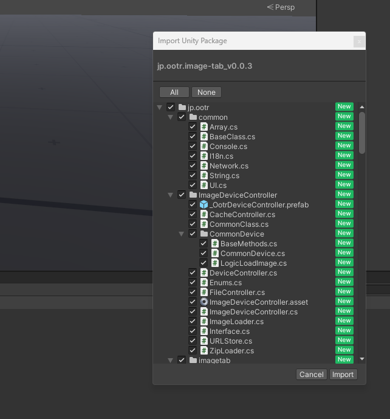
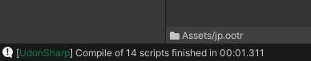
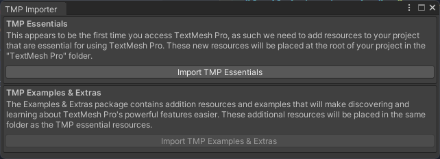
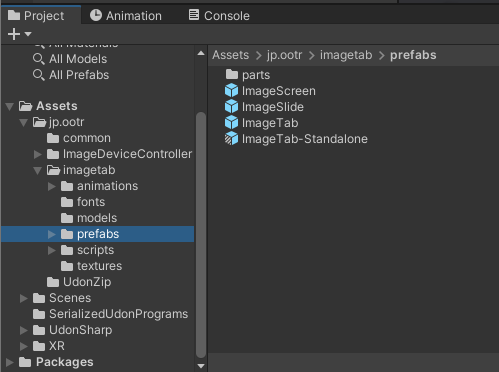
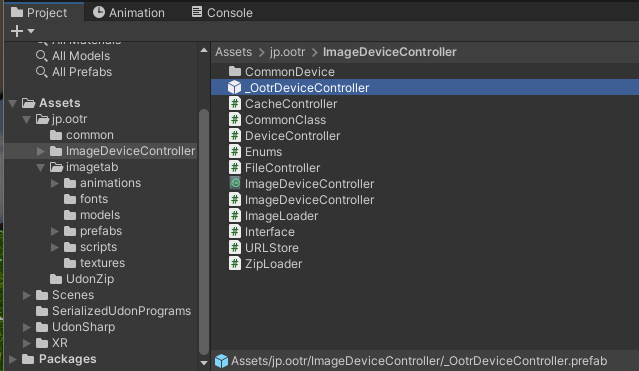
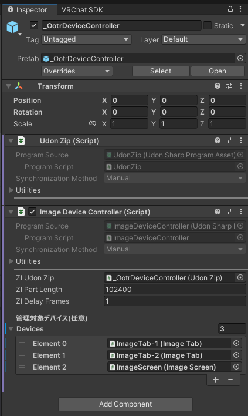


このドキュメントは今後更新されません
[最新版のドキュメントはこちらです](https://docs.ootr.jp/docs/Packages/ImageTab/creator/Intro) 


# クイックスタート

Unityや各パッケージの最小バージョンは対応するバージョンのリリースノートを参照してください

## 1. パッケージのインポート

ダウンロードしてきたUnityPackageファイルをインポートします


旧バージョンからアップデートされる場合は一旦削除してから再度インポートすることをおすすめします




UdonSharpのコンパイルに成功していることを確認してください  
もし、コンパイル時にエラーが発生している場合はSDKのバージョンが最小バージョンを満たしているか確認してください  
要件を満たしているのにエラーになる場合は開発者までお問い合わせください



TMPのインポートダイアログが表示された場合は `Import TMP Essentials` を押してパッケージのインポートをお願いします


## 2. ギミックの配置
  
`jp.ootr/imagetab/prefabs` 内にある各プレハブを必要に応じて配置してください  

各ギミックの使い方についてはユーザ向けガイドを確認してください

## 3. `ImageDeviceController` の配置

`ImageTab-Standalone`以外のギミックを配置していない場合はこの手順を飛ばしてください


`jp.ootr/ImageDeviceController` 内にある `_OotrDeviceController` というプレハブをシーンに配置してください  

次に、同一シーン内にある `ImageTab-Standalone` 以外のギミックすべてを `_OotrDeviceController` の `ImageDeviceController` スクリプトにある `管理対象デバイス(任意)` の欄に登録してください

## 4. ビルド&アップロード
以上でギミックの導入は完了です  
お疲れ様でした  
