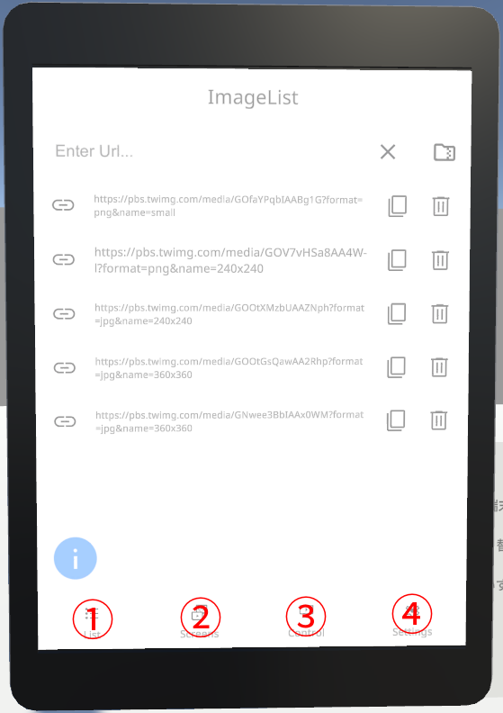
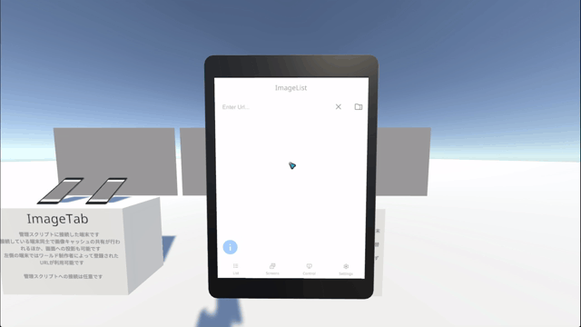
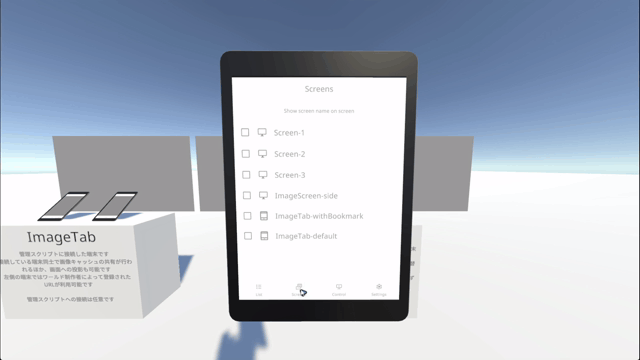
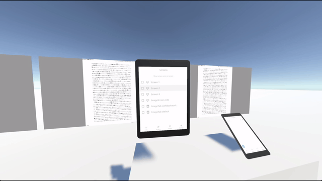

# ImageSlideの使い方

ImageSlideは画像投影用のギミックです  
あらかじめ複数の画像を読み込んでおくことで、端末を切り替えたり画像を読み込み直したりする手間なくスライドなどの資料を投影できます

## ① List

画像を読み込むための画面です

### ①画像URL用入力欄

ImageTabの入力欄と同様、画像のURLを入力できます

### ②TextZip形式URL用入力欄

一括で複数枚の画像を読み込むための独自形式 `TextZip` を用いたファイルのURLを入力できます


以下のサイトからPDFや画像をTextZip形式のファイルに変換できます  
https://slide.ootr.jp/


### ③URL

読み込まれている画像のURLを表示します


通常の画像の場合は`https://`から始まる実際のURL、TextZip形式の画像の場合は`zip://<元のURL>/<Zip内のパス>`という形式になります


### ④コピー

③で表示されているURLをコピーすることができます

### ⑤削除

該当する画像をリストから削除することができます

## ② Screens

投影対象として使用する端末を選択することができます

## ③ Control

### Prev

1枚前の画像を選択した画面に投影します

### Current

現在の画像を選択した画面に投影します

### Next

1枚後の画像を選択した画面に投影します

## ④ Settings

ImageTabと同様です
