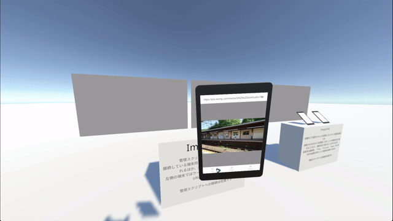

# ImageTabの使い方

## ① URL入力欄


URLは画像へ直接リンクしている必要があります。リダイレクトされるURLや画像を含むWebページは処理できません


クリックすると開く入力欄に画像のURLを入力することで画像を読み込むことができます

## ② 画像投影


ワールド制作者が投影機能を有効化していない場合があります  
その場合はこのボタンは表示されず、機能も利用できません


対象を選択することで各画面及び端末へ画像を投影することができます

各画面の名前は「Show screen name on screen」を押すことで確認可能です

「Cast to all screen」を選択することで全画面へ一括で投影することも可能です

## ③ ブックマーク/履歴機能


ワールド制作者がブックマークを設定していない場合は下段のように表記が変わり、履歴機能のみが有効となります  
  


### ブックマーク機能

`Library > Bookmark` からワールド制作者が設定したURLを読み込むことが可能です

### 履歴機能


履歴は各ユーザーごとにローカルです  
Join以前の履歴は同期されないほか、削除も同期されません


`Library > History`(Bookmarkが無効の場合は`History`)から履歴を確認可能です

#### ①画像の読み込み

URL部分を押すことでその画像を読み込むことができます

#### ②URLのコピー

表示されるURL入力画面からコピーすることができます

#### ③削除

履歴を削除します

## ④設定、その他

### ①自動回転

画面の自動回転を有効化／無効化できます

### ②各種情報

各種リンクやライセンス表記を確認できます

### ③デバイス名

画面投影時に識別子として使用されるデバイス名を確認できます
